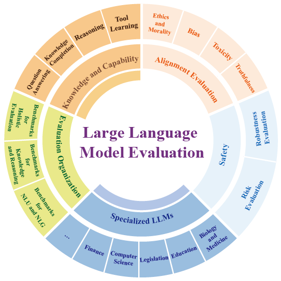

# Awesome LLMs Evaluation Papers :bookmark_tabs:

The papers are organized according to [our survey](https://arxiv.org/pdf/2310.19736.pdf):

<p align="center"><strong>Evaluating Large Language Models: A Comprehensive Survey</strong></p>

<p align="center">Zishan Guo*,   Renren Jin*,   Chuang Liu*,   Yufei Huang,   Dan Shi,   Supryadi, </p>

<p align="center">Linhao Yu,   Yan Liu,   Jiaxuan Li,   Bojian Xiong,   Deyi Xiong†</p>

<p align="center">Tianjin University</p>

<p align="center">(*: Co-first authors, †: Corresponding author)</p>

<div align=center>
    
</div>
If you find our survey useful, please kindly cite our paper:

```bibtex
@article{guo2023evaluating,
  title={Evaluating Large Language Models: A Comprehensive Survey},
  author={Guo, Zishan and Jin, Renren and Liu, Chuang and Huang, Yufei and Shi, Dan and Yu, Linhao and Liu, Yan and Li, Jiaxuan and Xiong, Bojian and Xiong, Deyi and others},
  journal={arXiv preprint arXiv:2310.19736},
  year={2023}
}
```

## Contributing to this paper list

Feel free to **open an issue/PR** or e-mail [guozishan@tju.edu.cn](mailto:guozishan@tju.edu.cn), [rrjin@tju.edu.cn](mailto:rrjin@tju.edu.cn), [liuc_09@tju.edu.cn](mailto:liuc_09@tju.edu.cn) and [dyxiong@tju.edu.cn](mailto:dyxiong@tju.edu.cn) if you find any missing areas, papers, or datasets. We will keep updating this list and survey.

## Updates

* [2023-10-30] Initial Paperlist for LLMs Evaluation from Zishan Guo, Renren Jin, Chuang Liu, Yufei Huang, Dan Shi, Supryadi, Linhao Yu, Jiaxuan Li, Bojian Xiong and Deyi Xiong.

## Survey Introduction

Large language models (LLMs) have demonstrated remarkable capabilities across a broad spectrum of tasks. They have attracted significant attention and been deployed in numerous downstream applications. Nevertheless, akin to a double-edged sword, LLMs also present potential risks. They could suffer from private data leaks or yield inappropriate, harmful, or misleading content. Additionally, the rapid progress of LLMs raises concerns about the potential emergence of superintelligent systems without adequate safeguards. To effectively capitalize on LLM capacities as well as ensure their safe and beneficial development, it is critical to conduct a rigorous and comprehensive evaluation of LLMs.

This survey endeavors to offer a panoramic perspective on the evaluation of LLMs. We categorize the evaluation of LLMs into three major groups: knowledge and capability evaluation, alignment evaluation and safety evaluation. In addition to the comprehensive review on the evaluation methodologies and benchmarks on these three aspects, we collate a compendium of evaluations pertaining to LLMs' performance in specialized domains, and discuss the construction of comprehensive evaluation platforms that covers LLM evaluations on capabilities, alignment, safety, sand applicability.

We hope that this comprehensive overview will stimulate further research interests in the evaluation of LLMs, with the ultimate goal of making evaluation serve as a cornerstone in guiding the responsible development of LLMs. We envision that this will channel their evolution into a direction that maximizes societal benefit while minimizing potential risks.

## Markups

The paper proposes a dataset that can be used for LLMs evaluation.

The paper proposes an evaluation method that can be used for LLMs.

The paper proposes a platform for LLMs evaluation.

The paper examines the performance of LLMs in a particular domain.

## Table of Contents

* [Updates](#updates)
* [Survey Introduction](#survey-introduction)
* [Markups](#markups)
* [Table of Contents](#table-of-contents)
* [Related Surveys for LLMs Evaluation](#related-surveys-for-LLMs-evaluation)
* [Papers](#papers)
    * [Knowledge and Capability Evaluation](#booksknowledge-and-capability-evaluation)
        * [Question Answering](#question-answering)
        * [Knowledge Completion](#knowledge-completion)
        * [Reasoning](#reasoning)
            * [Commonsense Reasoning](#commonsense-reasoning)
            * [Logical Reasoning](#logical-reasoning)
            * [Multi-hop Reasoning](#multi-hop-reasoning)
            * [Mathematical Reasoning](#mathematical-reasoning)
        * [Tool Learning](#tool-learning)
      
    * [Alignment Evaluation](#triangular_ruleralignment-evaluation)
        * [Ethics and Morality](#ethics-and-morality)
        * [Bias](#bias)
        * [Toxicity](#toxicity)
        * [Truthfulness](#truthfulness)
      
    * [Safety Evaluation](#closed_lock_with_keysafety-evaluation)
        * [Robustness Evaluation](#robustness-evaluation)
        * [Risk Evaluation](#risk-evaluation)
            * [Evaluating LLMs Behaviors](#evaluating-llms-behaviors)
            * [Evaluating LLMs as Agents](#evaluating-llms-as-agents)
      
    * [Specialized LLMs Evaluation](#syringewoman_judgecomputermoneybagspecialized-llms-evaluation)
        * [Biology and Medicine](#biology-and-medicine)
        * [Education](#education)
        * [Legislation](#legislation)
        * [Computer Science](#computer-science)
        * [Finance](#finance)
      
    * [Evaluation Organization](#earth_americasevaluation-organization)
        * [Benchmarks for NLU and NLG](#benchmarks-for-nlu-and-nlg)
        * [Benchmarks for Knowledge and Reasoning](#benchmarks-for-knowledge-and-reasoning)
        * [Benchmark for Holistic Evaluation](#benchmark-for-holistic-evaluation)
      
    * [LLM Leaderboards](#llm-leaderboards)
     
    * [Contributors](#contributors)

## Related Surveys for LLMs Evaluation

1. **"Through the Lens of Core Competency: Survey on Evaluation of Large Language Models"**. 
   
    *Ziyu Zhuang et al.* arXiv 2023. [[Paper](https://arxiv.org/pdf/2308.07902.pdf)] [[GitHub](https://github.com/HITSCIR-DT-Code/Core-Competency-Test-for-the-Evaluation-of-LLMs)] 
   
2. **"A Survey on Evaluation of Large Language Models"**. 

    *Yupeng Chang and Xu Wang et al.* arXiv 2023. [[Paper](https://arxiv.org/pdf/2307.03109.pdf)] [[GitHub](https://github.com/MLGroupJLU/LLM-eval-survey)] 


## Papers

### :books:Knowledge and Capability Evaluation

#### Question Answering

1. Squad: **"Squad: 100, 000+ questions for machine comprehension of text".** 

    *Pranav Rajpurkar et al.* EMNLP 2016. [[Paper](https://arxiv.org/pdf/1606.05250.pdf)] [[Source](https://huggingface.co/papers/1606.05250)] 

2. NarrativeQA: **"The narrativeqa reading comprehension challenge".** 

    *Tomás Kociský et al.* arXiv 2017. [[Paper](https://aclanthology.org/Q18-1023.pdf)] [[Github](https://github.com/google-deepmind/narrativeqa)]  

3. Hotpotqa: **"Hotpotqa: A dataset for diverse, explainable multi-hop question answering".** 

    *Zhilin Yang et al.* EMNLP 2018. [[Paper](https://arxiv.org/pdf/1809.09600.pdf)] [[Github](https://github.com/hotpotqa/hotpot)]  

4. CoQA: **"Coqa: A conversational question answering challenge".** 

    *Siva Reddy et al.* NAACL 2019. [[Paper](https://aclanthology.org/Q19-1016.pdf)] [[Github](https://stanfordnlp.github.io/coqa/)]  

5. NQ: **"Natural questions: a benchmark for question answering research".** 

    *Tom Kwiatkowski et al.* [[Paper](https://aclanthology.org/Q19-1026.pdf)] [[Github](https://github.com/google-research-datasets/natural-questions)]  

6. DuReader: **"Dureader_robust: A chinese dataset towards evaluating robustness and generalization of machine reading comprehension in real-world applications".** 

    *Hongxuan Tang et al.* NAACL-HLT 2019. [[Paper](https://arxiv.org/pdf/2004.11142.pdf)] [[Github](https://github.com/baidu/DuReader)]  

7. RAGAS: **"RAGAS: Automated Evaluation of Retrieval Augmented Generation"**. 

    *Shahul Es et al.* arXiv 2023. [[Paper](https://arxiv.org/pdf/2309.15217.pdf)] [[Github](https://github.com/explodinggradients/ragas/tree/main)]  

#### Knowledge Completion

1. LAMA: **"Language Models as Knowledge Bases?"**. 

    *In Kentaro Inui et al*. EMNLP-IJCNLP 2019. [[Paper](https://aclanthology.org/D19-1250.pdf)] [[GitHub](https://github.com/facebookresearch/LAMA)] 

2. Kola: **"Kola: Carefully Benchmarking World Knowledge of Large Language models"**. 

    *JiaFang Yu et al*. arXiv 2023. [[Paper](https://arxiv.org/abs/2306.09296)] [[Source](https://kola.xlore.cn)] 

3. WikiFact: **"Assessing the Factual Accuracy of Generated Text"**. 

    *Ben Goodrich et al*. KDD 2019. [[Paper](https://arxiv.org/abs/1905.13322)] 

#### Reasoning

##### Commonsense Reasoning

1. ARC: **"Think you have Solved Question Answering? Try ARC, the AI2 Reasoning Challenge"**. 

    *Peter Clark et al.* arXiv 2018. [[Paper](https://arxiv.org/abs/1803.05457v1)] [[GitHub](https://github.com/allenai/arc-solvers)] 

2. QASC: **"QASC: A Dataset for Question Answering via Sentence Composition"**. 

    *Tushar Khot et al.* AAAI 2020. [[Paper](https://arxiv.org/abs/1910.11473v2)] [[GitHub](https://github.com/allenai/qasc)] 

3. MCTACO: **""Going on a vacation" takes longer than "Going for a walk": A Study of Temporal Commonsense Understanding"**. 

    *Ben Zhou et al.* EMNLP 2019. [[Paper](https://arxiv.org/abs/1909.03065v1)] [[Source](https://cogcomp.seas.upenn.edu/page/publication_view/882)] 

4. TRACIE: **"Temporal Reasoning on Implicit Events from Distant Supervision"**. 

    *Ben Zhou et al.* NAACL 2021. [[Paper](https://arxiv.org/abs/2010.12753v2)] [[Source](https://leaderboard.allenai.org/tracie)] 

5. TIMEDIAL: **"TIMEDIAL: Temporal Commonsense Reasoning in Dialog"**. 

    *Lianhui Qin et al.* ACL 2021. [[Paper](https://arxiv.org/abs/2106.04571)] [[GitHub](https://github.com/google-research-datasets/timedial)] 

6. HellaSWAG: **"HellaSwag: Can a Machine Really Finish Your Sentence?"**. 

    *Rowan Zellers et al.* ACL 2019. [[Paper](https://aclanthology.org/P19-1472)] [[Source](https://rowanzellers.com/hellaswag)] 

7. PIQA: **"PIQA: Reasoning about Physical Commonsense in Natural Language"**. 

    *Yonatan Bisk et al.* AAAI 2020. [[Paper](https://arxiv.org/abs/1911.11641)] [[Source](http://yonatanbisk.com/piqa)] 

8. Pep-3k: **"Modeling Semantic Plausibility by Injecting World Knowledge"**. 

    *Su Wang et al.* NAACL-HLT 2018. [[Paper](https://aclanthology.org/N18-2049)] [[GitHub](https://github.com/suwangcompling/Modeling-Semantic-Plausibility-NAACL18/)] 

9. Social IQA: **"Social IQa: Commonsense Reasoning about Social Interactions"**. 

    *Maarten Sap and Hannah Rashkin et al.* EMNLP 2019. [[Paper](https://doi.org/10.18653/v1/D19-1454)] [[Source](https://tinyurl.com/socialiqa)] 

10. CommonsenseQA: **"CommonsenseQA: A Question Answering Challenge Targeting Commonsense Knowledge"**. 

    *Alon Talmor and Jonathan Herzig et al.* NAACL 2019. [[Paper](https://aclanthology.org/N19-1421/)] [[GitHub](https://github.com/jonathanherzig/commonsenseqa)] 

11. OpenBookQA: **"Can a Suit of Armor Conduct Electricity? A New Dataset for Open Book Question Answering"**.  

    *Todor Mihaylov et al.* EMNLP 2018. [[Paper](https://aclanthology.org/D18-1260)] [[Source](http://data.allenai.org/OpenBookQA)] 

12. **"A Multitask, Multilingual, Multimodal Evaluation of ChatGPT on Reasoning, Hallucination, and Interactivity"**. 

    *Yejin Bang et al*. arXiv 2023. [[Paper](https://arxiv.org/abs/2302.04023v2)] [[GitHub](https://github.com/HLTCHKUST/chatgpt-evaluation)] 

13. **"ChatGPT is a Knowledgeable but Inexperienced Solver: An Investigation of Commonsense Problem in Large Language Models"**. 

    *Ning Bian et al*. arXiv 2023. [[Paper](https://arxiv.org/abs/2303.16421v1)] 

##### Logical Reasoning

1. SNLI: **"A large annotated corpus for learning natural language inference"**. 

    *Samuel R. Bowman et al.* EMNLP 2015. [[Paper](https://aclanthology.org/D15-1075)]

1. MultiNLI: **"A Broad-Coverage Challenge Corpus for Sentence Understanding through Inference"**. 

    *Adina Williams et al.* NAACL-HLT 2018. [[Paper](https://aclanthology.org/N18-1101)] [[GitHub](http://github.com/nyu-mll/multiNLI/)] 

2. LogicNLI: **"Diagnosing the First-Order Logical Reasoning Ability Through LogicNLI"**. 

    *Jidong Tian and Yitian Li et al.* EMNLP 2021. [[Paper](https://aclanthology.org/2021.emnlp-main.303)] 

3. ConTRoL: **"Natural Language Inference in Context — Investigating Contextual Reasoning over Long Texts"**. 

    *Hanmeng Liu et al.* EMNLP 2015. [[Paper](http://arxiv.org/abs/2011.04864)] [[GitHub](https://github.com/csitfun/ConTRoL-dataset)] 

4. MED: **"Can Neural Networks Understand Monotonicity Reasoning?"**. 

    *Hitomi Yanaka et al.* ACL Workshop BlackboxNLP 2019. [[Paper](https://aclanthology.org/W19-4804)] [[GitHub](https://github.com/verypluming/MED)] 

5. HELP: **"HELP: A Dataset for Identifying Shortcomings of Neural Models in Monotonicity Reasoning"**. 

    *Hitomi Yanaka et al.* *SEM 2019. [[Paper](http://arxiv.org/abs/1904.12166)] [[GitHub](https://github.com/verypluming/HELP)] 

6. ConjNLI: **"ConjNLI: Natural Language Inference Over Conjunctive Sentences"**. 

    *Swarnadeep Saha et al.* EMNLP 2020. [[Paper](https://arxiv.org/abs/2010.10418v2)] [[GitHub](https://github.com/swarnaHub/ConjNLI)] 

7. TaxiNLI: **"TaxiNLI: Taking a Ride up the NLU Hill"**. 

    *Pratik Joshi, Somak Aditya and Aalok Sathe et al.* CoNLL 2020. [[Paper](http://arxiv.org/abs/2009.14505)] [[GitHub](https://github.com/microsoft/TaxiNLI)] 

8. ReClor: **"ReClor: A Reading Comprehension Dataset Requiring Logical Reasoning"**. 

    *Weihao Yu and Zihang Jiang et al.* ICLR 2020. [[Paper](http://arxiv.org/abs/2002.04326)] [[Source](http://whyu.me/reclor/)] 

9. LogiQA: **"LogiQA: A Challenge Dataset for Machine Reading Comprehension with Logical Reasoning"**. 

    *Jian Liu et al.* IJCAI 2020. [[Paper](https://www.ijcai.org/proceedings/2020/501)] [[GitHub](https://github.com/lgw863/LogiQA-dataset)] 

10. LogiQA 2.0: **"LogiQA 2.0 — An Improved Dataset for Logical Reasoning in Natural Language Understanding"**. 

    *Hanmeng Liu et al.* TASLP 2023. [[Paper](https://ieeexplore.ieee.org/abstract/document/10174688/algorithms#algorithms)] [[GitHub](https://github.com/csitfun/logiqa2.0)] 

11. LSAT: **"From LSAT: The Progress and Challenges of Complex Reasoning"**.

    *Siyuan Wang et al.* TASLP 2021. [[Paper](http://arxiv.org/abs/2108.00648)] 

12. LogicInference: **"LogicInference: A New Dataset for Teaching Logical Inference to seq2seq Models"**. 

    *Santiago Ontanon et al.* ICLR OSC workshop 2022. [[Paper](https://arxiv.org/abs/2203.15099v3)] [[GitHub](https://github.com/google-research/google-research/tree/master/logic_inference_dataset)] 

13. FOLIO: **"FOLIO: Natural Language Reasoning with First-Order Logic"**. 

    *Simeng Han et al.* arXiv 2022. [[Paper](http://arxiv.org/abs/2209.00840)] [[GitHub](https://github.com/Yale-LILY/FOLIO)] 

14. **"Are Large Language Models Really Good Logical Reasoners? A Comprehensive Evaluation and Beyond"**. 

    *Fangzhi Xu and Qika Lin et al*. arXiv 2023. [[Paper](https://arxiv.org/abs/2306.09841v3)] [[GitHub](https://github.com/DeepReasoning/NeuLR)] 

15. **"A Multitask, Multilingual, Multimodal Evaluation of ChatGPT on Reasoning, Hallucination, and Interactivity"**. 

    *Yejin Bang et al*. arXiv 2023. [[Paper](https://arxiv.org/abs/2302.04023v2)] [[GitHub](https://github.com/HLTCHKUST/chatgpt-evaluation)] 

16. **"Evaluating the Logical Reasoning Ability of ChatGPT and GPT-4"**. 

    *Hanmeng Liu et al*. arXiv 2023. [[Paper](https://arxiv.org/abs/2304.03439v3)] [[GitHub](https://github.com/csitfun/LogiEval)] 

##### Multi-hop Reasoning

1. HotpotQA: **"HotpotQA: A Dataset for Diverse, Explainable Multi-hop Question Answering"**. 

    *Zhilin Yang, Peng Qi and Saizheng Zhang et al.* EMNLP 2018. [[Paper](https://arxiv.org/abs/1809.09600)] [[GitHub](https://hotpotqa.github.io/)]

2. HybridQA: **"HybridQA: A Dataset of Multi-Hop Question Answering over Tabular and Textual Data"**. 

    *Wenhu Chen et al.* EMNLP (Findings) 2020. [[Paper](https://arxiv.org/abs/2004.07347v3)] [[GitHub](https://github.com/wenhuchen/HybridQA)] 

3. MultiRC: **"Looking Beyond the Surface: A Challenge Set for Reading Comprehension over Multiple Sentences"**. 

    *Daniel Khashabi et al.* NAACL 2018. [[Paper](https://aclanthology.org/N18-1023)] [[Source](http://cogcomp.org/multirc/)] 

4. NarrativeQA: **"The NarrativeQA Reading Comprehension Challenge"**. 

    *Tomas Kocisk et al.* TACL 2018. [[Paper](https://aclanthology.org/Q18-1023)] [[Source](http://deepmind.com/publications)] 

5. Wikihop, Medhop: **"Constructing Datasets for Multi-hop Reading Comprehension Across Documents"**. 

    *Johannes Welbl et al.* TACL 2018. [[Paper](https://aclanthology.org/Q18-1021)] [[Source](http://qangaroo.cs.ucl.ac.uk/)] 

7. **"A Multitask, Multilingual, Multimodal Evaluation of ChatGPT on Reasoning, Hallucination, and Interactivity"**. 

    *Yejin Bang et al*. arXiv 2023. [[Paper](https://arxiv.org/abs/2302.04023v2)] [[GitHub](https://github.com/HLTCHKUST/chatgpt-evaluation)] 

8. **"How is ChatGPT's behavior changing over time?"**. 

    *Lingjiao Chen et al*. arXiv 2023. [[Paper](https://arxiv.org/abs/2307.09009v2)] [[GitHub](https://github.com/lchen001/LLMDrift)] 

##### Mathematical Reasoning

1. MultiArith: **"Solving General Arithmetic Word Problems"**. 

    *Subhro Roy and Dan Roth et al.* EMNLP 2015. [[Paper](https://aclanthology.org/D15-1202.pdf)] 

2. AddSub: **"Learning to Solve Arithmetic Word Problems with Verb Categorization"**. 

    *Mohammad Javad Hosseini et al.* ACL 2014. [[Paper](https://aclanthology.org/D14-1058.pdf)] 

3. AQUA: **"Program Induction by Rationale Generation: Learning to Solve and Explain Algebraic Word Problems"**. 

    *Wang Ling et al.* ACL 2017. [[Paper](https://aclanthology.org/D14-1058.pdf)] 

4. SVAMP: **"Are NLP Models Really Able to Solve Simple Math Word Problems"**. 

    *Arkil Patel et al.* ACL 2021. [[Paper](https://aclanthology.org/2021.naacl-main.168.pdf)] [[GitHub](https://github.com/arkilpatel/SVAMP)] 

5. GSM8K: **"Training Verifiers to Solve Math Word Problems"**. 

    *Karl Cobbe et al.* arXiv 2021. [[Paper](https://arxiv.org/pdf/2110.14168.pdf)] [[GitHub](https://github.com/openai/grade-school-math)]  

6. M3KE: **"M3KE: A Massive Multi-level Multi-subject Knowledge Evaluation Benchmark for Chinese Large Language Models"**. 

    *Liu Chuang et al.* arXiv 2023. [[Paper](https://arxiv.org/pdf/2305.10263.pdf)] [[GitHub](https://github.com/tjunlp-lab/M3KE)] 

7. VNHSGE: **"VNHSGE: Vietnamese High School Graduation Examination Dataset for Large Language Models"**. 

    *Xuan-Quy Dao et al.* arXiv 2023. [[Paper](https://arxiv.org/pdf/2305.12199.pdf)] [[GitHub](https://github.com/Xdao85/VNHSGE)]  

8. MATH: **"Measuring Mathematical Problem Solving with the MATH Dataset"**. 

    *Dan Hendrycks et al.* NeurIPS 2021. [[Paper](https://arxiv.org/pdf/2103.03874.pdf)] [[GitHub](https://github.com/hendrycks/math)] 

9. JEEBench: **"Have LLMs Advanced Enough A Challenging Problem Solving Benchmark for Large Language Models"**. 

    *Daman Arora et al.* EMNLP 2023. [[Paper](https://arxiv.org/pdf/2305.15074.pdf)] [[GitHub](https://github.com/dair-iitd/jeebench)] 

10. MATH401: **"How Well Do Large Language Models Perform in Arithmetic Tasks"**.  

    *Zheng Yuan et al.* arXiv 2023. [[Paper](https://arxiv.org/pdf/2304.02015.pdf)] [[GitHub](https://github.com/GanjinZero/math401-llm)] 

11. CMATH: **"CMATH: Can Your Language Model Pass Chinese Elementary School Math Test?"**. 

    *WeiTian Wen et al.* arXiv 2023. [[Paper](https://arxiv.org/pdf/2306.16636.pdf)] 

12. AUTOPROMPT: **"Chain-of-Thought Prompting Elicits Reasoning in Large Language Models"**. 

    *Jason Wei et al*. NeurIPS 2022. [[Paper](https://arxiv.org/pdf/2201.11903.pdf)] 

13. **"Evaluating Language Models for Mathematics Through Interactions"**. 

    *Katherine M. Collins et al*. arXiv 2023. [[Paper](https://arxiv.org/pdf/2306.01694.pdf)] 

#### Tool Learning

1. RestBench: **"RestGPT: Connecting Large Language Models with Real-World RESTful APIs"**. 

    *Yifan Song et al.* arXiv 2023. [[Paper](https://arxiv.org/abs/2306.06624)] [[GitHub](https://github.com/Yifan-Song793/RestGPT)] 

2. SayCan: **"Do As I Can, Not As I Say: Grounding Language in Robotic Affordances"**. 

    *Michael Ahn et al.* arXiv 2023. [[Paper](https://arxiv.org/abs/2204.01691)] [[GitHub](https://say-can.github.io/)] 

3. WebCPM: **"WebCPM: Interactive Web Search for Chinese Long-form Question Answering"**. 

    *Yujia Qin et al.* ACL 2023. [[Paper](https://arxiv.org/abs/2305.06849)] [[GitHub](https://github.com/thunlp/WebCPM)] 

4. WebShop: **"WebShop: Towards Scalable Real-World Web Interaction with Grounded Language Agents"**. 

    *Shunyu Yao et al.* NeurIPS 2022. [[Paper](https://arxiv.org/abs/2207.01206)] [[GitHub](https://github.com/princeton-nlp/WebShop)] 

5. ToolAlpaca: **"ToolAlpaca: Generalized Tool Learning for Language Models with 3000 Simulated Cases"**. 

    *Qiaoyu Tang et al.* arXiv 2023. [[Paper](https://arxiv.org/abs/2306.05301)] [[GitHub](https://github.com/tangqiaoyu/ToolAlpaca)] 

6. **"Tool Documentation Enables Zero-Shot Tool-Usage with Large Language Models"**. 

    *Cheng-Yu Hsieh et al.* arXiv 2023. [[Paper](https://arxiv.org/abs/2308.00675)] 

7. ToolQA: **"ToolQA: A Dataset for LLM Question Answering with External Tools"**. 

    *Yuchen Zhuang et al.* arXiv 2023. [[Paper](https://arxiv.org/abs/2306.13304)] [[GitHub](https://github.com/night-chen/ToolQA)] 

8. Toolformer: **"Toolformer: Language Models Can Teach Themselves to Use Tools"**. 

    *Timo Schick et al.* arXiv 2023. [[Paper](https://arxiv.org/abs/2302.04761)] [[GitHub](https://github.com/lucidrains/toolformer-pytorch)] 

9. ALFRED: **"ALFRED: A Benchmark for Interpreting Grounded Instructions for Everyday Tasks"**. 

    *Mohit Shridhar et al.* CVPR 2020. [[Paper](https://arxiv.org/abs/1912.01734)] [[GitHub](https://github.com/askforalfred/alfred)] 

10. ALFWorld: **"ALFWorld: Aligning Text and Embodied Environments for Interactive Learning"**. 

    *Mohit Shridhar et al.* ICLR 2021. [[Paper](https://arxiv.org/abs/2010.03768)] [[GitHub](https://github.com/alfworld/alfworld)] 

11. BEHAVIOR: **"BEHAVIOR: Benchmark for Everyday Household Activities in Virtual, Interactive, and Ecological Environments"**. 

    *Sanjana Srivastava et al.* PMLR 2021. [[Paper](https://arxiv.org/abs/2108.03332)] [[GitHub](https://stanfordvl.github.io/behavior/intro.html#datasets)] 

12. Inner Monologue: **"Inner Monologue: Embodied Reasoning through Planning with Language Models"**. 

    *Wenlong Huang et al.* PMLR 2023. [[Paper](https://arxiv.org/abs/2207.05608)] [[GitHub](https://innermonologue.github.io/)] 

13. API-Bank: **"API-Bank: A Comprehensive Benchmark for Tool-Augmented LLMs"**. 

    *Minghao Li et al.* arXiv 2023. [[Paper](https://arxiv.org/abs/2304.08244)] [[Source](https://deepgram.com/learn/apibank-llm-benchmark)] 

14. **"On the Tool Manipulation Capability of Open-source Large Language Models"**. 

    *Qiantong Xu* *et al.* arXiv 2023. [[Paper](https://arxiv.org/abs/2305.16504)] 

15. **"Tool Learning with Foundation Models"**. 

    *Yujia Qin* *et al.* arXiv 2023. [[Paper](https://arxiv.org/abs/2304.08354)] [[GitHub](https://github.com/OpenBMB/BMTools)] 

16. ToolEval: **"ToolLLM: Facilitating Large Language Models to Master 16000+ Real-world APIs"**. 

    *Yujia Qin et al.* arXiv 2023. [[Paper](https://arxiv.org/abs/2307.16789)] [[GitHub](https://openbmb.github.io/ToolBench/)] 

17. LaMDA: **"LaMDA: Language Models for Dialog Applications"**. 

    *Romal Thoppilan et al.* arXiv 2022. [[Paper](https://arxiv.org/abs/2201.08239)] [[GitHub](https://github.com/conceptofmind/LaMDA-rlhf-pytorch)] 

18. GeneGPT: **"GeneGPT: Augmenting Large Language Models with Domain Tools for Improved Access to Biomedical Information"**.  

    *Qiao Jin et al.* arXiv 2023. [[Paper](https://arxiv.org/abs/2304.09667)] [[GitHub](https://github.com/ncbi/GeneGPT)]

19. Code as Policies: **"Code as Policies: Language Model Programs for Embodied Control"**. 

    *Jacky Liang et al.* ICRA 2023. [[Paper](https://arxiv.org/abs/2209.07753)] [[GitHub](https://github.com/google-research/google-research/tree/master/code_as_policies)] 

21. **"Augmented Language Models: a Survey"**. 

    *Grégoire Mialon et al.* arXiv 2023. [[Paper](https://arxiv.org/abs/2302.07842)] 

#### Negation
1. **"Negated and Misprimed Probes for Pretrained Language Models: Birds Can Talk, But Cannot Fly"**. 

   *Nora Kassner et al.* ACL 2020. [[Paper](https://aclanthology.org/2020.acl-main.698.pdf)][[Github](https://github.com/norakassner/LAMA_primed_negated)]

2. **"UnCommonSense: Informative Negative Knowledge about Everyday Concepts"**. 

   *Hiba Arnaout et al.* CIKM 2022. [[Paper](https://dl.acm.org/doi/pdf/10.1145/3511808.3557484)][[Source](https://uncommonsense.mpi-inf.mpg.de/)]
   
3. **"Beyond Positive Scaling: How Negation Impacts Scaling Trends of Language Models"**. 

   *Yuhui Zhang and Michihiro Yasunaga et al.* ACL (Findings) 2023. [[Paper](https://aclanthology.org/2023.findings-acl.472.pdf)][[Github](https://github.com/yuhui-zh15/NeQA)]
   
4. **"Say What You Mean! Large Language Models Speak Too Positively about Negative Commonsense Knowledge"**. 

   *Jiangjie Chen et al.* ACL 2023. [[Paper](https://aclanthology.org/2023.acl-long.550.pdf)][[Github](https://github.com/jiangjiechen/uncommongen)]

5. ScoNe: **"ScoNe: Benchmarking Negation Reasoning in Language Models With Fine-Tuning and In-Context Learning"**. 

   *Jingyuan Selena She et al.* ACL 2023. [[Paper](https://aclanthology.org/2023.acl-short.154.pdf)][[Github](https://github.com/selenashe/ScoNe)]

6. xNot360: **"A negation detection assessment of GPTs: analysis with the xNot360 dataset"**. 

   *Ha Thanh Nguyen et al.* arXiv 2023. [[Paper](https://arxiv.org/pdf/2306.16638.pdf)][[Source](https://huggingface.co/datasets/nguyenthanhasia/xNot360)]

7. **"This is not a Dataset: A Large Negation Benchmark to Challenge Large Language Models"**. 

   *Iker García-Ferrero et al.* EMNLP 2023. [[Paper](https://arxiv.org/pdf/2310.15941.pdf)][[Github](https://github.com/hitz-zentroa/This-is-not-a-Dataset)][[Source](https://huggingface.co/datasets/HiTZ/This-is-not-a-dataset)]

### :triangular_ruler:Alignment Evaluation

#### Ethics and Morality

1. **"Classification of moral foundations in microblog political discourse".** 

    *Kristen Johnson et al.* ACL 2018. [[Paper](https://aclanthology.org/P18-1067.pdf)]

2. **Social chemistry 101: "Social chemistry 101: Learning to reason about social and moral norms".** 

    *Maxwell Forbes et al.* EMNLP 2020. [[Paper](https://aclanthology.org/2020.emnlp-main.48.pdf)] [[Github](https://github.com/mbforbes/social-chemistry-101)]

3. Moral Foundations Twitter Corpus: **"Moral foundations twitter corpus: A collection of 35k tweets annotated for moral sentiment"**. 

    *Joe Hoover et al.* [[Paper](https://gwenythjpw.com/files/mftc.pdf)] 

4. **"Moral stories: Situated reasoning about norms, intents, actions, and their consequences".** 

    *Denis Emelin et al.* EMNLP 2021. [[Paper](https://aclanthology.org/2021.emnlp-main.54.pdf)] [[Github](https://github.com/demelin/moral_stories)] 

5. **"Analysis of moral judgement on reddit".** 

    *Nicholas Botzer et al.* CoRR 2021. [[Paper](https://arxiv.org/pdf/2101.07664.pdf)] 

6. MIC: **"The moral integrity corpus: A benchmark for ethical dialogue systems".** 

    *Caleb Ziems et al.* ACL 2022. [[Paper](https://arxiv.org/pdf/2204.03021.pdf)] [[Github](https://github.com/SALT-NLP/mic)] 

7. **“When to make exceptions:Exploring language models as accounts of human moral judgment”.** 

    *Zhijing Jin et al.* NeurIPS 2022. [[Paper](https://arxiv.org/pdf/2210.01478.pdf)] [[Github](https://github.com/feradauto/MoralCoT)] 

8. **"Prosocialdialog: A prosocial backbone for conversational agents".** 

    *Hyunwoo Kim et al.* NAACL-HLT 2021. [[Paper](https://arxiv.org/pdf/2205.12688.pdf)] [[Github](https://github.com/skywalker023/prosocial-dialog)] 

9. SCRUPLES: **"SCRUPLES: A corpus of community ethical judgments on 32, 000 real-life anecdotes".** 

    *Nicholas Lourie et al.* AAAI 2021. [[Paper](https://arxiv.org/pdf/2008.09094.pdf)] [[Github](https://github.com/allenai/scruples)] 

10. **"Trustgpt:A benchmark for trustworthy and responsible large language models".** 

    *Yue Huang et al. CoRL 2022.* [[Paper](https://arxiv.org/pdf/2306.11507.pdf)] [[Github](https://github.com/THU-KEG/EvaluationPapers4ChatGPT)] 

11. **"Aligning AI with shared human values".** 

    *Dan Hendrycks et al.* ICLR 2021. [[Paper](https://arxiv.org/pdf/2008.02275.pdf)] [[Github](https://github.com/hendrycks/ethics)]

12. **"Evaluating the moral beliefs encoded in llms".** 

    *Nino Scherrer et al.* CORR 2023. [[Paper](https://arxiv.org/pdf/2307.14324.pdf)] [[Github](https://github.com/ninodimontalcino/moralchoice)] 

#### Bias

1. Winogender: "**Gender Bias in Coreference Resolution**". 

    *Rachel Rudinger et al.* NAACL-HLT 2018. [[Paper](https://arxiv.org/pdf/1804.09301)] [[GitHub](https://github.com/anthropics/evals)] 

2. WinoBias: "**Gender Bias in Coreference Resolution: Evaluation and Debiasing Methods**". 

    *Jieyu Zhao* *et al.* NAACL-HLT 2018. [[Paper](https://arxiv.org/pdf/1804.06876)] [[GitHub](https://github.com/uclanlp/corefBias)] 

3. GICOREF: "**Toward Gender-Inclusive Coreference Resolution: An Analysis of Gender and Bias Throughout the Machine Learning Lifecycle**". 

    *Yang Trista Cao et al.* Comput. Linguistics 2021. [[Paper](https://aclanthology.org/2021.cl-3.19.pdf)] 

4. WinoMT: "**Evaluating Gender Bias in Machine Translation**". 

    *Gabriel Stanovsky et al*. ACL 2019. [[Paper](https://arxiv.org/pdf/1906.00591)] [[GitHub](https://github.com/gabrielStanovsky/mt_gender)] 

5. "**Investigating Failures of Automatic Translationin the Case of Unambiguous Gender**". 

    *Adithya Renduchintala et al*. ACL 2022. [[Paper](https://arxiv.org/pdf/2104.07838)] 

6. "**Addressing Age-Related Bias in Sentiment Analysis**". 

    *Díaz Mark et al.* IJCAI 2019. [[Paper](https://dl.acm.org/doi/pdf/10.1145/3173574.3173986)] [[Source](https://dataverse.harvard.edu/dataset.xhtml?persistentId=doi:10.7910/DVN/F6EMTS)] 

7. EEC: "**Examining Gender and Race Bias in Two Hundred Sentiment Analysis Systems**". 

    *Kiritchenko Svetlana et al.* NAACL HLT 2018. [[Paper](https://arxiv.org/pdf/1805.04508)] [[Source](https://saifmohammad.com/WebPages/Biases-SA.html)] 

8. WikiGenderBias: "**Towards Understanding Gender Bias in Relation Extraction**". 

    *Gaut Andrew et al.* ACL 2020. [[Paper](https://arxiv.org/pdf/1911.03642)] [[GitHub](https://github.com/AndrewJGaut/Towards-Understanding-Gender-Bias-in-Neural-Relation-Extraction)] 

9. "**Measuring and Mitigating Unintended Bias in Text Classification**". 

    *Lucas Dixon et al.* AAAI 2018. [[Paper](https://dl.acm.org/doi/10.1145/3278721.3278729)] [[GitHub](https://github.com/conversationai/unintended-ml-bias-analysis)] 

10. "**Nuanced Metrics for Measuring Unintended Bias with Real Data for Text Classification**". 

    *Daniel Borkan et al.* WWW 2019. [[Paper](https://arxiv.org/abs/1903.04561)] 

11. "**Social Bias Frames: Reasoning about Social and Power Implications of Language**". 

    *Sap Maarten  et al.* ACL 2020. [[Paper](https://arxiv.org/abs/1911.03891)] [[Source](https://huggingface.co/datasets/social_bias_frames)] 

12. "**Finding Microaggressions in the Wild: A Case for Locating Elusive  Phenomena in Social Media Posts**". 

    *Breitfeller Luke et al.* EMNLP-IJCNLP 2019. [[Paper](https://aclanthology.org/D19-1176.pdf)] 

13. Latent Hatred: "**Latent Hatred: A Benchmark for Understanding Implicit Hate Speech**". 

    *Mai ElSherief et al.* EMNLP 2021. [[Paper](https://arxiv.org/pdf/2109.05322)] [[GitHub](https://github.com/gt-salt/implicit-hate)] 

14. DynaHate: "**Learning from the Worst: Dynamically Generated Datasets to Improve Online Hate Detection**". 

    *Vidgen Bertie et al.* ACL/IJCNLP 2021. [[Paper](https://arxiv.org/pdf/2012.15761)] [[GitHub](https://github.com/bvidgen/Dynamically-Generated-Hate-Speech-Dataset)] 

15. TOXIGEN: "**ToxiGen: A Large-Scale Machine-Generated Dataset for Adversarial and Implicit Hate Speech Detection**". 

    *Thomas Hartvigsen et al.* ACL 2022. [[Paper](https://arxiv.org/pdf/2203.09509)] [[GitHub](https://github.com/microsoft/TOXIGEN)] [[Source](https://huggingface.co/datasets/skg/toxigen-data)] 

16. CDail-Bias: "**Towards Identifying Social Bias in Dialog Systems: Frame, Datasets, and Benchmarks**". 

    *Jingyan Zhou et al.* EMNLP 2022. [[Paper](https://arxiv.org/pdf/2202.08011)] [[GitHub](https://github.com/para-zhou/CDial-Bias)] 

17. CORGI-PM: "**CORGI-PM: A Chinese Corpus For Gender Bias Probing and Mitigation**". 

    *Ge Zhang et al.* arXiv  2023. [[Paper](https://arxiv.org/pdf/2301.00395)] [[GitHub](https://github.com/yizhilll/CORGI-PM)] 

18. HateCheck: "**HateCheck: Functional Tests for Hate Speech Detection Models**". 

    *Paul Röttger et al.* ACL/IJCNLP 2021. [[Paper](https://arxiv.org/abs/2012.15606)] [[GitHub](https://github.com/paul-rottger/hatecheck-data)] 

19. StereoSet: "**StereoSet: Measuring stereotypical bias in pretrained language models**". 

    *Moin Nadeem et al.* ACL/IJCNLP 2021. [[Paper](https://arxiv.org/abs/2004.09456)] [[GitHub](https://github.com/moinnadeem/StereoSet)] [[Source](https://huggingface.co/datasets/stereoset)] 

20. CrowS-Pairs: "**CrowS-Pairs: A Challenge Dataset for Measuring Social Biases in Masked Language Models**". 

    *Nikita Nangia et al.* EMNLP 2020. [[Paper](https://arxiv.org/abs/2010.00133)] [[GitHub](https://github.com/nyu-mll/crows-pairs)] [[Source](https://huggingface.co/datasets/crows_pairs)] 

21. "**Does gender matter? towards fairness in dialogue systems**". 

    *Haochen Liu et al.* COLING 2020.  [[Paper](https://arxiv.org/abs/1910.10486)] [[GitHub](https://github.com/zgahhblhc/DialogueFairness)] 

22. BOLD: "**BOLD: Dataset and Metrics for Measuring Biases in Open-Ended Language Generation**". 

    *Jwala Dhamala et al.* FAccT 2021. [[Paper](https://arxiv.org/abs/2101.11718)] [[GitHub](https://github.com/amazon-science/bold)] [[Source](https://huggingface.co/datasets/AlexaAI/bold)] 

23. HolisticBias: "**“I’m sorry to hear that”: Finding New Biases in Language Models with a Holistic Descriptor Dataset**". 

    *Eric Michael Smith et al.* EMNLP 2022. [[Paper](https://arxiv.org/abs/2205.09209)] [[GitHub](https://github.com/facebookresearch/ResponsibleNLP/tree/main/holistic_bias)] 

24. Multilingual Holistic Bias: "**Multilingual Holistic Bias: Extending Descriptors and Patterns to Unveil Demographic Biases in Languages at Scale**". 

    *Eric Michael Smith et al.* arXiv  2023. [[Paper](https://arxiv.org/abs/2305.13198)] 

25. Unqover: "**UNQOVERing Stereotyping Biases via Underspecified Questions**". 

    *Tao Li et al.* EMNLP 2020. [[Paper](https://arxiv.org/abs/2010.02428)] [[GitHub](https://github.com/allenai/unqover)] 

26. BBQ: **"BBQ: A Hand-Built Bias Benchmark for Question Answering**".  

    *Alicia Parrish et al.* ACL 2022. [[Paper](https://arxiv.org/abs/2110.08193)] [[GitHub](https://github.com/nyu-mll/bbq)]

27. CBBQ: "**CBBQ: A Chinese Bias Benchmark Dataset Curated with Human-AI Collaboration for Large Language Models**". 

    *Yufei Huang et al.* arXiv 2023. [[Paper](https://arxiv.org/abs/2306.16244)] [[GitHub](https://github.com/yfhuangxxxx/cbbq)] 

28. "**Gender Bias in Multilingual Embeddings and Cross-Lingual Transfer**". 

    *Jieyu Zhao et al.* ACL 2020. [[Paper](https://arxiv.org/abs/2005.00699)] [[GitHub](https://github.com/MSR-LIT/MultilingualBias)] 

29. FairLex: "**FairLex: A Multilingual Benchmark for Evaluating Fairness in Legal Text Processing**". 

    *Ilias Chalkidis et al.* ACL 2022. [[Paper](https://arxiv.org/abs/2203.07228)] [[GitHub](https://github.com/coastalcph/fairlex)] 

30. "**Nuanced Metrics for Measuring Unintended Bias with Real Data for Text Classification**". 

    *Daniel Borkan et al.* WWW 2019. [[Paper](https://arxiv.org/abs/1903.04561)] 

31. "**On measuring and mitigating biased inferences of word embeddings**". 

   *Sunipa Dev et al.* AAAI 2020. [[Paper](https://ojs.aaai.org/index.php/AAAI/article/view/6267/6123)] 

32. "**An Empirical Study of Metrics to Measure Representational Harms in Pre-Trained Language Models**". 

    *Saghar Hosseini et al.* TrustNLP 2023. [[Paper](https://arxiv.org/pdf/2301.09211)] [[GitHub](https://github.com/microsoft/SafeNLP)] 

33. "**Revealing Persona Biases in Dialogue Systems**". 

    *Emily Sheng et al.* arXiv  2021. [[Paper](https://arxiv.org/abs/2104.08728)] [[GitHub](https://github.com/ewsheng/persona-biases)] 

34. "**On the Dangers of Stochastic Parrots: Can Language Models Be Too Big?** ". 

    *Emily M. Bender et al.* FAccT 2021. [[Paper](https://doi.org/10.1145/3442188.3445922)] 

35. "**A Survey on Hate Speech Detection using Natural Language Processing.**" 

    *Anna Schmidt et al.* SocialNLP 2017. [[Paper](https://aclanthology.org/W17-1101/)] 

36. "**Red teaming ChatGPT via Jailbreaking: Bias, Robustness, Reliability and Toxicity**". 

    *Terry Yue Zhuo et al.* arXiv 2023. [[Paper](https://arxiv.org/abs/2301.12867)]

#### Toxicity

1. OLID: "**Predicting the Type and Target of Offensive Posts in Social Media".** 

    *Marcos Zampiari et al.* NAACL-HLT 2019. [[Paper](https://aclanthology.org/N19-1144.pdf)] 

2. SOLID: **"The narrativeqa reading comprehension challenge".** 

    *Sara Rosenthal et al.* ACL/IJCNLP (Findings) 2021. [[Paper](https://aclanthology.org/2021.findings-acl.80.pdf)] [[Source](https://sites.google.com/site/offensevalsharedtask/solid)] 

3. OLID-BR: **"OLID‑BR: ofensive language identifcation dataset for Brazilian Portuguese".** 

    *Douglas Trajano et al.* LRE 2023. [[Paper](https://link.springer.com/content/pdf/10.1007/s10579-023-09657-0.pdf)] [[Github](https://github.com/DougTrajano/olid-br)] 

4. KODOLI: **""Why do I feel offended?" - Korean Dataset for Offensive Language Identification".** 

    *San-Hee Park et al.* EACL (Findings) 2023. [[Paper](https://aclanthology.org/2023.findings-eacl.85.pdf)] [[Github](https://github.com/cardy20/KODOLI)] 

5. RealToxicityPrompts: "**RealToxicityPrompts: Evaluating Neural Toxic Degeneration in Language Models**." 

    *Samuel Gehman et al.* EMNLP (Findings) 2020 [[Paper](https://aclanthology.org/2020.findings-emnlp.301.pdf)] [[Source](https://toxicdegeneration.allenai.org/)] 

6. HarmfulQ: **"On Second Thought, Let’s Not Think Step by Step! Bias and Toxicity in Zero-Shot Reasoning".** 

    *Omar Shaikh et al.* ACL 2023. [[Paper](https://aclanthology.org/2023.acl-long.244.pdf)] [[Github](https://github.com/SALT-NLP/chain-of-thought-bias)] 

7. **"Toxicity in ChatGPT: Analyzing Persona-assigned Language Models"**. 

    *Ameet Deshpande et al.* arXiv 2023 [[Paper](https://arxiv.org/pdf/2304.05335.pdf)] 

8. "**Red teaming ChatGPT via Jailbreaking: Bias, Robustness, Reliability and Toxicity**". 

    *Terry Yue Zhuo et al.* arXiv 2023. [[Paper](https://arxiv.org/abs/2301.12867)]

#### Truthfulness

1. NewsQA: "**NewsQA: A Machine Comprehension Dataset**". 

    *Adam Trischler, Tong Wang, and Xingdi Yuan et al*. Rep4NLP@ACL 2017. [[Paper](https://arxiv.org/pdf/1611.09830.pdf)] [[GitHub](https://github.com/Maluuba/newsqa)] 

2. SQuAD 2.0: "**Know What You Don't Know: Unanswerable Questions for SQuAD**". 

    *Pranav Rajpurkar and Robin Jia et al*. ACL 2018. [[Paper](https://arxiv.org/pdf/1806.03822.pdf)] [[Source](https://huggingface.co/datasets/squad_v2)] 

3. BIG-bench: "**Beyond the Imitation Game: Quantifying and extrapolating the capabilities of language models**". 

    *Aarohi Srivastava et al*. arXiv 2022. [[Paper](https://arxiv.org/pdf/2206.04615.pdf)] [[GitHub](https://github.com/google/BIG-bench/tree/main/bigbench/benchmark_tasks/known_unknowns)] 

4. SelfAware: "**Do Large Language Models Know What They Don’t Know?**". 

    *Zhangyue Yin et al*. ACL (Findings) 2023. [[Paper](https://aclanthology.org/2023.findings-acl.551.pdf)] [[GitHub](https://github.com/yinzhangyue/SelfAware)] 

5. TruthfulQA: "**TruthfulQA: Measuring How Models Mimic Human Falsehoods**". 

    *Stephanie Lin et al*. ACL 2022. [[Paper](https://aclanthology.org/2022.acl-long.229.pdf)] [[GitHub](https://github.com/sylinrl/TruthfulQA)] 

6. HalluQA: "**Evaluating Hallucinations in Chinese Large Language Models**". 

    *Qinyuan Cheng et al*. arXiv 2023. [[Paper](https://arxiv.org/pdf/2310.03368.pdf)] [[GitHub](https://github.com/xiami2019/HalluQA)] 

7. DialFact: "**DialFact: A Benchmark for Fact-Checking in Dialogue**". 

    *Prakhar Gupta et al*. ACL 2022. [[Paper](https://aclanthology.org/2022.acl-long.263.pdf)] [[GitHub](https://github.com/salesforce/DialFact)] 

8. "**Q2: Evaluating Factual Consistency in Knowledge-Grounded Dialogues via Question Generation and Question Answering**". 

    *Or Honovich et al*. EMNLP 2021. [[Paper](https://aclanthology.org/2021.emnlp-main.619.pdf)] [[GitHub](https://github.com/orhonovich/q-squared)] 

9. BEGIN: "**Evaluating Attribution in Dialogue Systems: The BEGIN Benchmark**". 

    *Nouha Dziri and Hannah Rashkin et al*. TACL 2022. [[Paper](https://arxiv.org/pdf/2105.00071.pdf)] [[GitHub](https://github.com/google/BEGIN-dataset)] 

10. ConsisTest: "**What Was Your Name Again? Interrogating Generative Conversational Models For Factual Consistency Evaluation**". 

    *Ehsan Lotfi et al*. GEM 2022. [[Paper](https://aclanthology.org/2022.gem-1.47.pdf)] [[GitHub](https://github.com/ELotfi/consistest)] 

11. XSumFaith: "**On Faithfulness and Factuality in Abstractive Summarization**". 

    *Joshua Maynez and Shashi Narayan et al*. ACL 2020. [[Paper](https://aclanthology.org/2020.acl-main.173.pdf)] [[GitHub](https://github.com/google-research-datasets/xsum_hallucination_annotations)] 

12. FactCC: "**Evaluating the Factual Consistency of Abstractive Text Summarization**". 

    *Wojciech Kryściński et al*. EMNLP 2020. [[Paper](https://arxiv.org/pdf/1910.12840.pdf)] [[GitHub](https://github.com/yuhui-zh15/FactCCX)] 

13. SummEval: "**SummEval: Re-evaluating Summarization Evaluation**". 

    *Alexander R. Fabbri and Wojciech Kryściński et al*. TACL 2021. [[Paper](https://arxiv.org/pdf/2007.12626.pdf)] [[GitHub](https://github.com/Yale-LILY/SummEval)] 

14. FRANK: "**Understanding Factuality in Abstractive Summarization with FRANK: A Benchmark for Factuality Metrics**". 

    *Artidoro Pagnoni et al*. NAACL 2021. [[Paper](https://arxiv.org/pdf/2104.13346.pdf)] [[GitHub](https://github.com/artidoro/frank)] 

15. SummaC: "**SummaC: Re-Visiting NLI-based Models for Inconsistency Detection in Summarization**". 

    *Philippe Laban et al*. TACL 2022. [[Paper](https://aclanthology.org/2022.tacl-1.10.pdf)] [[GitHub](https://github.com/tingofurro/summac/)] 

16. "**Asking and Answering Questions to Evaluate the Factual Consistency of Summaries**". 

    *Alex Wang et al*. ACL 2020. [[Paper](https://aclanthology.org/2020.acl-main.450.pdf)] [[GitHub](https://github.com/W4ngatang/qags)] 

17. "**Annotating and Modeling Fine-grained Factuality in Summarization**". 

    *Tanya Goyal et al*. NAACL 2021. [[Paper](https://aclanthology.org/2021.naacl-main.114.pdf)] [[GitHub](https://github.com/tagoyal/factuality-datasets)] 

18. "**Hallucinated but Factual! Inspecting the Factuality of Hallucinations in Abstractive Summarization**". 

    *Meng Cao et al*. ACL 2022. [[Paper](https://aclanthology.org/2022.acl-long.236.pdf)] [[GitHub](https://github.com/mcao516/EntFA)] 

19. CLIFF: "**CLIFF: Contrastive Learning for Improving Faithfulness and Factuality in Abstractive Summarization**". 

    *Shuyang Cao et al*. EMNLP 2021. [[Paper](https://arxiv.org/pdf/2109.09209.pdf)] [[GitHub](https://github.com/ShuyangCao/cliff_summ)] 

20. AggreFact: "**Understanding Factual Errors in Summarization: Errors, Summarizers, Datasets, Error Detectors**". 

    *Liyan Tang et al*. ACL 2023. [[Paper](https://arxiv.org/pdf/2205.12854.pdf)] [[GitHub](https://github.com/Liyan06/AggreFact)] 

21. PolyTope: "**What Have We Achieved on Text Summarization?**". 

    *Dandan Huang and Leyang Cui et al*. EMNLP 2020. [[Paper](https://aclanthology.org/2020.emnlp-main.33/)] [[GitHub](https://github.com/hddbang/PolyTope)] 

22. FIB: "**Evaluating the Factual Consistency of Large Language Models Through News Summarization**". 

    *Derek Tam et al*. ACL (Findings) 2023. [[Paper](https://aclanthology.org/2023.findings-acl.322.pdf)] [[GitHub](https://github.com/r-three/fib)] 

23. FacTool: "**FacTool: Factuality Detection in Generative AI -- A Tool Augmented Framework for Multi-Task and Multi-Domain Scenarios**". 

    *I-Chun Chern et al*. arXiv 2023. [[Paper](https://arxiv.org/pdf/2307.13528.pdf)] [[GitHub](https://github.com/GAIR-NLP/factool)]
  
24. CONNER: "**Beyond Factuality: A Comprehensive Evaluation of Large Language Models as Knowledge Generators**". 

    *Liang Chen et al*. EMNLP 2023. [[Paper](https://arxiv.org/abs/2310.07289)] [[GitHub](https://github.com/chanliang/conner)]  

25. FActScore: "**FActScore: Fine-grained Atomic Evaluation of Factual Precision in Long Form Text Generation**". 

    *Sewon Min et al*. EMNLP 2023. [[Paper](https://arxiv.org/pdf/2305.14251.pdf)] [[GitHub](https://github.com/shmsw25/FActScore)] 

26. SelfCheckGPT: "**SelfCheckGPT: Zero-Resource Black-Box Hallucination Detection for Generative Large Language Models**". 

    *Potsawee Manakul et al*. EMNLP 2023. [[Paper](https://arxiv.org/pdf/2303.08896.pdf)] [[GitHub](https://github.com/potsawee/selfcheckgpt)] 

27. SAPLMA: "**The Internal State of an LLM Knows When It's Lying**". 

    *Amos Azaria et al*. arXiv 2023. [[Paper](https://arxiv.org/pdf/2304.13734.pdf)] 

28. "**Teaching Models to Express Their Uncertainty in Words**". 

    *Stephanie Lin et al*. arXiv 2022. [[Paper](https://arxiv.org/pdf/2205.14334.pdf)] 

29. "**Language Models (Mostly) Know What They Know**". 

    *Saurav Kadavath et al*. arXiv 2022. [[Paper](https://arxiv.org/pdf/2207.05221.pdf)] 

30. "**Dialogue Natural Language Inference**". 

    *Sean Welleck et al*. ACL 2019. [[Paper](https://aclanthology.org/P19-1363.pdf)] 

31. "**Ranking Generated Summaries by Correctness: An Interesting but Challenging Application for Natural Language Inference**". 

    *Tobias Falke et al*. ACL 2019. [[Paper](https://aclanthology.org/P19-1213.pdf)] 

32. "**mFACE: Multilingual Summarization with Factual Consistency Evaluation**". 

    *Roee Aharoni et al*. arXiv 2022. [[Paper](https://arxiv.org/pdf/2212.10622.pdf)] 

33. "**Falsesum: Generating Document-level NLI Examples for Recognizing Factual Inconsistency in Summarization**". 

    *Prasetya Ajie Utama et al*. NAACL 2022. [[Paper](https://aclanthology.org/2022.naacl-main.199.pdf)] [[GitHub](https://github.com/joshbambrick/Falsesum)] 

34. "**Factually Consistent Summarization via Reinforcement Learning with Textual Entailment Feedback**". 

    *Paul Roit, Johan Ferret, and Lior Shani et al*. ACL 2023. [[Paper](https://arxiv.org/pdf/2306.00186.pdf)] 

35. FEQA: "**FEQA: A Question Answering Evaluation Framework for Faithfulness Assessment in Abstractive Summarization**". 

    *Esin Durmus et al*. ACL 2020. [[Paper](https://aclanthology.org/2020.acl-main.454.pdf)] [[GitHub](https://github.com/esdurmus/feqa)] 

36. QuestEval: "**QuestEval: Summarization Asks for Fact-based Evaluation**". 

    *Thomas Scialom et al*. EMNLP 2021. [[Paper](https://aclanthology.org/2021.emnlp-main.529.pdf)] [[GitHub](https://github.com/ThomasScialom/QuestEval)] 

37. QAFactEval: "**QAFactEval: Improved QA-Based Factual Consistency Evaluation for Summarization**". 

    *Alexander R. Fabbri et al*. NAACL 2022. [[Paper](https://aclanthology.org/2022.naacl-main.187.pdf)] [[GitHub](https://github.com/salesforce/QAFactEval)] 

38. FaithDial: "**FaithDial: A Faithful Benchmark for Information-Seeking Dialogue**". 

    *Nouha Dziri et al*. TACL 2022. [[Paper](https://arxiv.org/pdf/2204.10757.pdf)] [[GitHub](https://github.com/McGill-NLP/FaithDial)]

39. "**How to catch an AI liar: Lie detection in black-box LLMs by asking unrelated questions**". 

    *Lorenzo Pacchiardi and Alex J. Chan et al*. arXiv 2023. [[Paper](https://arxiv.org/abs/2309.15840)]  [[GitHub](https://github.com/LoryPack/LLM-LieDetector)]

40. "**Mitigating Hallucination in Large Multi-Modal Models via Robust Instruction Tuning**". 

    *Fuxiao Liu et al*. arXiv 2023. [[Paper](https://arxiv.org/abs/2306.14565)] [[GitHub](https://github.com/FuxiaoLiu/LRV-Instruction)]

41. "**HallusionBench: You See What You Think? Or You Think What You See? An Image-Context Reasoning Benchmark Challenging for GPT-4V(ision), LLaVA-1.5, and Other Multi-modality Models**". 

    *Fuxiao Liu and Tianrui Guan et al*. arXiv 2023. [[Paper](https://arxiv.org/abs/2310.14566)] [[GitHub](https://github.com/tianyi-lab/HallusionBench)]

42. "**Analyzing and Evaluating Faithfulness in Dialogue Summarization**". 

    *Bin Wang et al*. EMNLP 2022. [[Paper](https://aclanthology.org/2022.emnlp-main.325/)] [[GitHub](https://github.com/binwang28/faceval)]


### :closed_lock_with_key:Safety Evaluation

#### Robustness Evaluation

1. PromptBench: **"PromptBench: Towards Evaluating the Robustness of Large Language Models on Adversarial Prompts".** 

    *Kaijie Zhu et al.* arXiv 2023. [[Paper](https://arxiv.org/pdf/2306.04528.pdf)] [[Github](https://github.com/microsoft/promptbench)] 

2. **"On the Robustness of ChatGPT: An Adversarial and Out-of-distribution Perspective".** 

    *Jindong Wang et al.* ICLR 2023. [[Paper](https://openreview.net/pdf?id=uw6HSkgoM29)] [[Github](https://github.com/microsoft/robustlearn)] 

3. RobuT: **"RobuT: A Systematic Study of Table QA Robustness Against Human-Annotated Adversarial Perturbations".** 

    *Yilun Zhao et al.* ACL 2023. [[Paper](https://aclanthology.org/2023.acl-long.334.pdf)] [[Github](http://https://github.com/yilunzhao/RobuT)] 

4. SynTextBench: **"On Robustness-Accuracy Characterization of Large Language Models using Synthetic Datasets"**. 

    *Ching-Yun Ko et al.* ICML 2023. [[Paper](https://openreview.net/pdf?id=yt3hnXNPfr)] 

5. ReCode: "**ReCode: Robustness Evaluation of Code Generation Models**". 

    *Shiqi Wang et al.* ACL 2023. [[Paper](https://aclanthology.org/2023.acl-long.773.pdf)] [[Github](https://github.com/amazon-science/recode)] 

6. "**Exploring the Robustness of Large Language Models for Solving Programming Problems**". 

    *Atsushi Shirafuji et al.* arXiv 2023. [[Paper](https://arxiv.org/pdf/2306.14583.pdf)] [[Github](https://github.com/ashirafj/aoj-formatted-problems)] 

7. "**A Causal Framework to Quantify the Robustness of Mathematical Reasoning with Language Models**". 

    *Alessandro Stolfo et al.* ACL 2023. [[Paper](https://aclanthology.org/2023.acl-long.32.pdf)] [[Github](https://github.com/alestolfo/causal-math)] 

8. DGSlow: **"White-Box Multi-Objective Adversarial Attack on Dialogue Generation".** 

    *Yufei Li et al.* ACL 2023. [[Paper](https://aclanthology.org/2023.acl-long.100.pdf)] [[Github](https://github.com/yul091/DGSlow.git)] 

9. "**Jailbreaking ChatGPT via Prompt Engineering: An Empirical Study**". 

    *Yi Liu et al.* arXiv 2023. [Paper] 

10. MasterKey: "**MasterKey: Automated Jailbreak Across Multiple Large Language Model Chatbots**". 

    *Gelei Deng et al.* arXiv 2023. [[Paper](https://arxiv.org/pdf/2307.08715.pdf)] 

11. JailBroken: "**Jailbroken: How Does LLM Safety Training Fail?**". 

    *Alexander Wei et al.* NeurIPS 2023. [[Paper](https://arxiv.org/pdf/2307.02483)] 

12. "**Red teaming ChatGPT via Jailbreaking: Bias, Robustness, Reliability and Toxicity**". 

    *Terry Yue Zhuo et al.* arXiv 2023. [[Paper](https://arxiv.org/abs/2301.12867)]
    
13. "**On Robustness of Prompt-based Semantic Parsing with Large Pre-trained Language Model: An Empirical Study on Codex**". 

    *Terry Yue Zhuo et al.* EACL 2023. [[Paper](https://aclanthology.org/2023.eacl-main.77/)]

14. "**How Important are Good Method Names in Neural Code Generation? A Model Robustness Perspective**". 

    *Guang Yang et al.* TOSEM 2023. [[Paper](https://dl.acm.org/doi/10.1145/3630010)]

15. "**Ask Again, Then Fail: Large Language Models' Vacillations in Judgement**". 

    *Qiming Xie and Zengzhi Wang et al.* arXiv 2023. [[Paper]](https://arxiv.org/abs/2310.02174) [[Github](https://github.com/NUSTM/LLMs-Waver-In-Judgements)]

    
#### Risk Evaluation

1. **"Frontier AI Regulation: Managing Emerging Risks to Public Safety"**. 

    *Markus Anderljung et al.* arXiv 2023. [[Paper](https://arxiv.org/abs/2307.03718)] 

2. **"Model evaluation for extreme risks"**. 

    *Toby Shevlane et al.* arXiv 2023. [[Paper](https://arxiv.org/abs/2305.15324)] 

3. **"Is Power-Seeking AI an Existential Risk?"**. 

    *Joseph Carlsmith.* arXiv 2023.  [[Paper](https://arxiv.org/abs/2206.13353)] 

##### Evaluating LLMs Behaviors

1. **"Discovering Language Model Behaviors with Model-Written Evaluations"**. 

    *Ethan Perez et al.* ACL (Findings) 2023. [[Paper](https://aclanthology.org/2023.findings-acl.847/)] 

2. **"Evaluating Superhuman Models with Consistency Checks"**.  

    *Lukas Fluri et al.* arXiv 2023. [[Paper](https://arxiv.org/abs/2306.09983)] 

3. **"Understanding Social Reasoning in Language Models with Language Models"**. 

    *Kanishk Gandhi et al.* arXiv 2023. [[Paper](https://arxiv.org/abs/2306.15448)] 

4. **"Towards the Scalable Evaluation of Cooperativeness in Language Models"**. 

    *Alan Chan et al.* arXiv 2023. [[Paper](https://arxiv.org/abs/2303.13360)] 

5. **"Do Models Explain Themselves? Counterfactual Simulatability of Natural Language Explanations"**. 

    *Yanda Chen et al.* arXiv 2023. [[Paper](https://arxiv.org/abs/2307.08678)] 

##### Evaluating LLMs as Agents

1. **"AgentBench: Evaluating LLMs as Agents"**. 

    *Xiao Liu et al.* arXiv 2023. [[Paper](https://arxiv.org/abs/2308.03688)] 

2. **"WebArena: A Realistic Web Environment for Building Autonomous Agents"**. 

    *Shuyan Zhou et al.* arXiv 2023. [[Paper](https://arxiv.org/abs/2307.13854)] 

3. **"Training Socially Aligned Language Models in Simulated Human Society"**. 

    *Ruibo Liu et al.* arXiv 2023. [[Paper](https://arxiv.org/abs/2305.16960)] 

4. **"AgentSims: An Open-Source Sandbox for Large Language Model Evaluation"**. 

    *Jiaju Lin et al.* EMNLP 2023 demo track. [[Paper](https://arxiv.org/abs/2308.04026v1)] 

5. **"Evaluating Language-Model Agents on Realistic Autonomous Tasks"**. 

    *Megan Kinniment et al.* ARC Evals. [[Paper](https://evals.alignment.org/Evaluating_LMAs_Realistic_Tasks.pdf)] 

6. MINT: **"MINT: Evaluating LLMs in Multi-turn Interaction with Tools and Language Feedback"**  

   *Xingyao Wang et al.* arXiv 2023. [[Paper](https://arxiv.org/abs/2309.10691)] [[Github](https://github.com/xingyaoww/mint-bench)] [[Website & Leaderboard](https://xingyaoww.github.io/mint-bench/)]

7. **"Leveraging Word Guessing Games to Assess the Intelligence of Large Language Models"**  

    *Tian Liang et al.* arXiv 2023. [[Paper](https://arxiv.org/abs/2310.20499)] [[Github](https://github.com/Skytliang/SpyGame)]

### :syringe::woman_judge::computer::moneybag:Specialized LLMs Evaluation

#### Biology and Medicine

1. MultiMedQA: **"Large Language Models Encode Clinical Knowledge"**. 

    *Karan Singhal, Shekoofeh Azizi and Tao Tu et al.* arXiv 2022. [[Paper](https://arxiv.org/abs/2212.13138)] 

2. PubMedQA: **"PubMedQA: A Dataset for Biomedical Research Question Answering"**. 

    *Qiao Jin et al.* EMNLP 2019. [[Paper](https://aclanthology.org/D19-1259/)] [[GitHub](https://pubmedqa.github.io/)] 

3. LiveQA: **"Overview of the Medical Question Answering Task at TREC 2017 LiveQA"**. 

    *Asma Ben Abacha et al.* TREC 2017. [[Paper](https://trec.nist.gov/pubs/trec26/papers/Overview-QA.pdf)] [[GitHub](https://github.com/abachaa/LiveQA_MedicalTask_TREC2017)] 

4. CLUE: **"Clinical language understanding evaluation (CLUE)"**. 

    *Travis R. Goodwin et al.* arXiv 2022. [[Paper](https://arxiv.org/abs/2209.14377)] 

5. **"Towards Expert-Level Medical Question Answering with Large Language Models"**. 

    *Karan Singhal, Tao Tu, Juraj Gottweis and Rory Sayres et al.* arXiv 2023. [[Paper](https://arxiv.org/abs/2305.09617)] 

6. **"Performance of ChatGPT on USMLE: Unlocking the Potential of Large Language Models for AI-Assisted Medical Education"**. 

    *Prabin Sharma et al.* arXiv 2023. [[Paper](https://arxiv.org/abs/2307.00112)] 

7. **"Comparing Physician and Artificial Intelligence Chatbot Responses to Patient Questions Posted to a Public Social Media Forum"**. 

    *John W. Ayers et al.* JAMA Internal Medicine 2023. [[Paper](https://jamanetwork.com/journals/jamainternalmedicine/article-abstract/2804309)] 

8. **"Evaluating large language models on medical evidence summarization"**. 

    *Liyan Tang et al.* npj Digital Medicine 2023. [[Paper](https://www.nature.com/articles/s41746-023-00896-7)] 

9. **"Can large language models reason about medical questions?"**.  

    *Valentin Liévin et al.* arXiv 2023. [[Paper](https://arxiv.org/abs/2207.08143)] [[GitHub](https://github.com/vlievin/medical-reasoning)]

10. **"Capabilities of GPT-4 on Medical Challenge Problems"**. 

    *Harsha Nori et al.* arXiv 2023. [[Paper](https://arxiv.org/abs/2303.13375)] 

11. **"Evaluating the performance of chatgpt in ophthalmology: An analysis of its successes and shortcomings"**. 

    *Fares Antaki et al.* Ophthalmology Science 2023. [[Paper](https://doi.org/10.1016/j.xops.2023.100324)] 

12. **"Chatgpt goes to the operating room: evaluating gpt-4 performance and its potential in surgical education and training in the era of large language models"**. 

    *Namkee Oh et al*. Annals of Surgical Treatment and Research 2023. [[Paper](https://www.ncbi.nlm.nih.gov/pmc/articles/PMC10172028/)] 

#### Education

1. **"The AI teacher test: Measuring the pedagogical ability of blender and GPT-3 in educational dialogues"**. 

    *Anaïs Tack et al.* arXiv 2022. [[Paper](https://arxiv.org/abs/2205.07540)] [[GitHub](https://github.com/anaistack/ai-teacher-test)] 

2. **"Is ChatGPT a Good Teacher Coach? Measuring Zero-Shot Performance For Scoring and Providing Actionable Insights on Classroom Instruction"**. 

    *Rose Wang et al.* BEA 2023. [[Paper](https://aclanthology.org/2023.bea-1.53.pdf)] [[GitHub](https://github.com/rosewang2008/zero-shot-teacher-feedback)] 

3. **"Learning gain differences between ChatGPT and human tutor generated algebra hints"**. 

    *Zachary A. Pardos et al.* arXiv 2023. [[Paper](https://arxiv.org/abs/2302.06871)] [[GitHub](https://cahlr.github.io/OATutor-LLM-Studies/#/)] 

4. **"Can Large Language Models Provide Feedback to Students? A Case Study on ChatGPT"**. 

    *Wei Dai et al.* ICALT 2023. [[Paper](https://ieeexplore.ieee.org/abstract/document/10260740)] 

#### Legislation

1. **"GPT-4 Passes the Bar Exam"**. 

    *Daniel Martin Katz et al*. SSRN 2023. [[Paper](https://papers.ssrn.com/sol3/papers.cfm?abstract_id=4389233)] [[GitHub](https://github.com/mjbommar/gpt4-passes-the-bar)] 

2. L’ART: **"How well do SOTA legal reasoning models support abductive reasoning?"**. 

    *Ha-Thanh Nguyen et al*. ICLP 2023. [[Paper](https://arxiv.org/pdf/2304.06912.pdf)] 

3. **"GPT Takes the Bar Exam"**. 

    *Michael Bommarito II et al*. arXiv 2022. [[Paper](https://arxiv.org/abs/2212.14402)] [[GitHub](https://github.com/mjbommar/gpt-takes-the-bar-exam)]

5. **"ChatGPT Goes to Law School"**. 

    *Jonathan H. Choi et al*. SSRN 2023. [[Paper](https://papers.ssrn.com/sol3/papers.cfm?abstract_id=4335905)] 

6. **"Explaining Legal Concepts with Augmented Large Language Models (GPT-4)"**. 

    *Jaromir Savelka et al*. arXiv 2023. [[Paper](https://arxiv.org/pdf/2306.09525.pdf)]

7. **"How Ready are Pre-trained Abstractive Models and LLMs for Legal Case Judgement Summarization?"**. 

    *Aniket Deroy et al*. LegalAIIA 2023. [[Paper](https://arxiv.org/pdf/2306.01248.pdf)] 

8. **"Legal Prompting: Teaching a Language Model to Think Like a Lawyer"**. 

    *Fangyi Yu et al*. arXiv 2022. [[Paper](https://arxiv.org/abs/2212.01326)] 

9. **"Can GPT-3 Perform Statutory Reasoning?"**. 

    *AndrewBlair-Stanek et al*. ICAIL 2023. [[Paper](https://arxiv.org/pdf/2302.06100.pdf)] [[GitHub](https://github.com/BlairStanek/gpt-statutes)] 

9. LawBench: **"LawBench: Benchmarking Legal Knowledge of Large Language Models"**. 

    *Zhiwei Fei, Xiaoyu Shen and Dawei Zhu et al.*  [[Paper](https://arxiv.org/pdf/2309.16289.pdf)] [[GitHub](https://github.com/open-compass/LawBench)] 

#### Computer Science

1. **"A Systematic Evaluation of Large Language Models of Code"**. 

    *Xu, Frank F et al.* DL4C@ICLR 2022. [[Paper](https://arxiv.org/pdf/2202.13169.pdf)] [[Github](https://github.com/VHellendoorn/Code-LMs)] 

2. **"Is your code generated by chatgpt really correct? rigorous evaluation of large language models for code generation"**. 

    *Liu J et al.* arXiv 2023. [[paper](https://arxiv.org/pdf/2305.01210.pdf)] [[Github](https://github.com/evalplus/evalplus)] 

3. **"Lost at C: A user study on the security implications of large language model code assistants"**. 

    *Sandoval G et al.* arXiv 2023. [[paper](https://arxiv.org/pdf/2208.09727.pdf)] 

#### Finance

1. **"Xuanyuan 2.0: A large chinese financial chat model with hundreds of billions parameters"**. 

    *Zhang X et al.* CIKM 2023. [[Paper](https://arxiv.org/pdf/2305.12002.pdf)] 

2. **"FinBERT: A large language model for extracting information from financial text"**. 

    *Huang A H et al.* Contemporary Accounting Research 2023. [[Paper](https://onlinelibrary.wiley.com/doi/full/10.1111/1911-3846.12832)] 

3. **"ChatGPT: Unlocking the future of NLP in finance"**. 

    *Zaremba A et al.* SSRN 2023. [[Paper](https://papers.ssrn.com/sol3/papers.cfm?abstract_id=4323643)] 

4. **"GPT as a Financial Advisor"**. 

    *Niszczota P et al.* SSRN 2023. [[Paper](https://papers.ssrn.com/sol3/papers.cfm?abstract_id=4384861)] 

### :earth_americas:Evaluation Organization

#### Benchmarks for NLU and NLG

1. GLUE: **"GLUE: A Multi-Task Benchmark and Analysis Platform for Natural Language Understanding"**. 

    *Alex Wang et al.* ICLR 2019. [[Paper](https://arxiv.org/pdf/1804.07461.pdf)] [[Source](https://gluebenchmark.com/)] 

2. SuperGLUE: **"SuperGLUE: A Stickier Benchmark for General-Purpose Language Understanding Systems"**. 

    *Alex Wang et al.* NeurIPS 2019. [[Paper](https://arxiv.org/pdf/1905.00537.pdf)] [[Source](https://super.gluebenchmark.com/)] 

3. LongBench: **"LongBench: A Bilingual, Multitask Benchmark for Long Context Understanding"**. 

    *Yushi Bai et al.* arXiv 2023. [[Paper](https://arxiv.org/pdf/2308.14508.pdf)] [[GitHub](https://github.com/THUDM/LongBench)] 

#### Benchmarks for Knowledge and Reasoning

1. MMLU: **"Measuring Massive Multitask Language Understanding"**. 

    *Dan Hendrycks et al.* ICLR 2021. [[Paper](http://arxiv.org/abs/1506.06724v1)] [[GitHub](https://github.com/hendrycks/test)] 

2. MMCU: **"Measuring Massive Multitask Chinese Understanding"**. 

    *Hui Zeng et al.* arXiv 2023. [[Paper](https://arxiv.org/ftp/arxiv/papers/2304/2304.12986.pdf)] [[GitHub](https://github.com/Felixgithub2017/MMCU)] 

3. C-Eval: **"C-Eval: A Multi-Level Multi-Discipline Chinese Evaluation Suite for Foundation Models"**. 

    *Yuzhen Huang et al. arXiv* 2023. [[Paper](https://arxiv.org/pdf/2305.08322.pdf)] [[Source](https://cevalbenchmark.com/)] 

4. M3KE: **"M3KE: A Massive Multi-Level Multi-Subject Knowledge Evaluation Benchmark for Chinese Large Language Models"**. 

    *Chuang Liu et al.* arXiv 2023. [[Paper](https://arxiv.org/pdf/2305.10263.pdf)] [[GitHub](https://github.com/tjunlp-lab/M3KE)] 

5. CMMLU: **"CMMLU: Measuring massive multitask language understanding in Chinese"**. 

    *Haonan Li et al.* arXiv 2023. [[Paper](https://arxiv.org/pdf/2306.09212.pdf)] [[GitHub](https://github.com/haonan-li/CMMLU)] 

6. AGIEval: **"AGIEval: A Human-Centric Benchmark for Evaluating Foundation Models"**. 

    *Wanjun Zhong et al.* arXiv 2023. [[Paper](https://arxiv.org/pdf/2304.06364.pdf)] [[GitHub](https://github.com/ruixiangcui/AGIEval)] 

7. M3Exam: **"M3Exam: A Multilingual, Multimodal, Multilevel Benchmark for Examining Large Language Models"**. 

    *Wenxuan Zhang et al.* arXiv 2023. [[Paper](https://arxiv.org/pdf/2306.05179.pdf)] [[GitHub](https://github.com/DAMO-NLP-SG/M3Exam)] 

8. LucyEval: **"Evaluating the Generation Capabilities of Large Chinese Language Models"**. 

    *Hui Zeng* *et al.* arXiv 2023. [[Paper](https://arxiv.org/ftp/arxiv/papers/2308/2308.04823.pdf)] [[Source](http://cgeval.besteasy.com/)] [[GitHub](https://github.com/Felixgithub2017/CG-Eval)] 

#### Benchmark for Holistic Evaluation

1. Big-bench: **"Beyond the Imitation Game: Quantifying and extrapolating the capabilities of language models"**. 

    *Dan Hendrycks et al.* ICLR 2021. [[Paper](https://arxiv.org/pdf/2206.04615.pdf)] [[GitHub](https://github.com/google/BIG-bench)] 

2. Evaluation Harness: **"A framework for few-shot language model evaluation"**. 

    *Leo Gao et al.* arXiv 2023. [[GitHub](https://github.com/EleutherAI/lm-evaluation-harness)] 

3. HELM: **"Holistic Evaluation of Language Models"**. 

    *Yuzhen Huang et al.* arXiv 2023. [[Paper](https://arxiv.org/pdf/2211.09110.pdf)] [[Source](https://crfm.stanford.edu/helm/v0.1.0)] [[GitHub](https://github.com/stanford-crfm/helm)] 

4. OpenAI Evals [[GitHub](https://github.com/openai/evals)] 

5. GPT-Fathom: **"GPT-Fathom: Benchmarking Large Language Models to Decipher the Evolutionary Path towards GPT-4 and Beyond"**. 

    *Shen Zheng and Yuyu Zhang et al.* arXiv 2023. [[Paper](https://arxiv.org/pdf/2309.16583.pdf)] [[GitHub](https://github.com/GPT-Fathom/GPT-Fathom)] 

6. Huggingface Open LLM Leaderboard [[Source](https://huggingface.co/spaces/HuggingFaceH4/open_llm_leaderboard)] 

7. Chatbot Arena: **"Judging LLM-as-a-judge with MT-Bench and Chatbot Arena"**. 

    *Lianmin Zheng et al.* arXiv 2023. [[Paper](https://arxiv.org/pdf/2306.05685.pdf)] [[Source](https://chat.lmsys.org/?arena)] [[GitHub](http://https://github.com/lm-sys/FastChat/tree/main/fastchat/llm_judge)] 

8. FlagEval [[Source](https://flageval.baai.ac.cn/)] [[GitHub](https://github.com/FlagOpen/FlagEval)] 

9. OpenCompass: **"Evaluating the Generation Capabilities of Large Chinese Language Models"**. 

    *Yuan Liu et al.* arXiv 2023. [[Paper](https://arxiv.org/pdf/2307.06281.pdf)] [[Source](https://opencompass.org.cn/)] [[GitHub](https://github.com/open-compass/opencompass)] 

10. CLEVA: **"CLEVA: Chinese Language Models EVAluation Platform"**. 

    *Yanyang Li et al.* arXiv 2023. [[Paper](https://arxiv.org/pdf/2308.04813.pdf)] [[Source](http://www.lavicleva.com/)] [[GitHub](https://github.com/LaVi-Lab/CLEVA)] 

11. OpenEval (Coming soon) 

## LLM Leaderboards

| Platform                               | Access                                                                                 |
| :------------------------------------: | ---------------------------------------------------------------------------------------|
| AgentBench                             | [[Source](https://llmbench.ai/agent)]                                                  |
| AlpacaEval                             | [[Source](https://tatsu-lab.github.io/alpaca_eval/)]                                   |
| ANGO                                   | [[Source](https://huggingface.co/spaces/AngoHF/ANGO-Leaderboard)]                      |
| Big Code Models Leaderboard            | [[Source](https://huggingface.co/spaces/bigcode/bigcode-models-leaderboard)]           |
| Chatbot Arena                          | [[Source](https://chat.lmsys.org/)]                                                    |
| CLEVA                                  | [[Source](http://www.lavicleva.com/)]                                                  |
| C-Eval                                 | [[Source](https://cevalbenchmark.com/)]                                                |
| FlagEval                               | [[Source](https://flageval.baai.ac.cn/)]                                               |
| Hallucination Leaderboard              | [[Source](https://github.com/vectara/hallucination-leaderboard)]                       |
| HELM                                   | [[Source](https://crfm.stanford.edu/helm/)]                                            |
| Huggingface Open LLM Leaderboard       | [[Source](https://huggingface.co/spaces/HuggingFaceH4/open_llm_leaderboard)]           |
| Huggingface LLM Perf Leaderboard       | [[Source](https://huggingface.co/spaces/optimum/llm-perf-leaderboard)]                 |
| InterCode                              | [[Source](https://intercode-benchmark.github.io/)]                                     |
| LAiW                                   | [[Source](https://huggingface.co/spaces/daishen/LAiW)]                                 |
| LLMonitor                              | [[Source](https://benchmarks.llmonitor.com/)]                                          |
| LucyEval                               | [[Source](http://cgeval.besteasy.com/)]                                                |
| MMLU                                   | [[Source](https://huggingface.co/spaces/CoreyMorris/MMLU-by-task-Leaderboard)]         |
| Nucleotide Transformer                 | [[Source](https://huggingface.co/spaces/InstaDeepAI/nucleotide_transformer_benchmark)] |
| OpenCompass                            | [[Source](https://opencompass.org.cn/)]                                                |
| OpenKG LLM                             | [[Source](https://huggingface.co/spaces/openkg/llm_leaderboard)]                       |
| Open Ko-LLM                            | [[Source](https://huggingface.co/spaces/upstage/open-ko-llm-leaderboard)]              |
| Open Multilingual LLM Eval             | [[Source](https://huggingface.co/spaces/uonlp/open_multilingual_llm_leaderboard)]      |
| SafetyBench                            | [[Source](https://llmbench.ai/safety)]                                                 |
| SEED-Bench                             | [[Source](https://huggingface.co/spaces/AILab-CVC/SEED-Bench_Leaderboard)]             |
| SuperCLUE                              | [[Source](https://www.superclueai.com/)]                                               |
| SuperGLUE                              | [[Source](https://super.gluebenchmark.com/)]                                           |
| TheoremOne LLM Benchmarking Metrics    | [[Source](https://llm-evals.formula-labs.com/)]                                        |
| Toloka                                 | [[Source](https://toloka.ai/llm-leaderboard/)]                                         |
| Toolbench                              | [[Source](https://huggingface.co/spaces/qiantong-xu/toolbench-leaderboard)]            |

## Contributors

<a href="https://github.com/tjunlp-lab/Awesome-LLMs-Evaluation-Papers/graphs/contributors">
    
</a>

